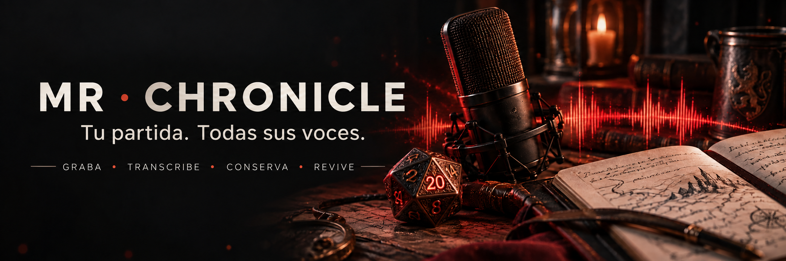
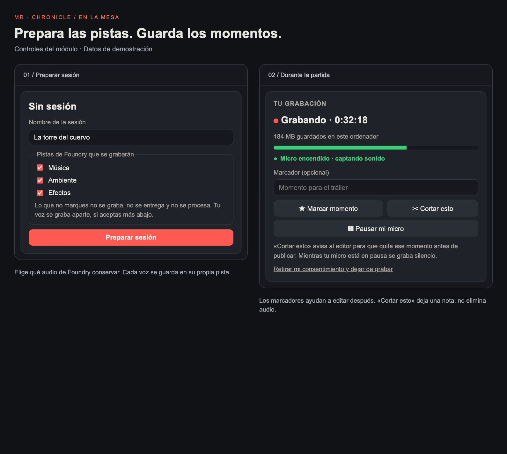
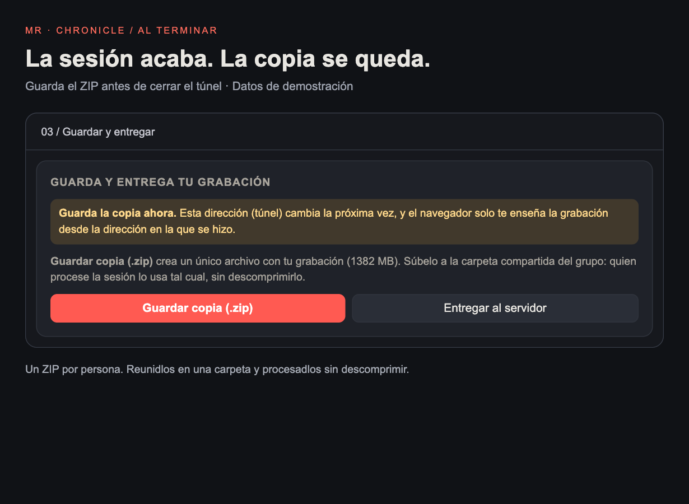

<p align="center">
  
</p>

<p align="center"><strong>Convierte tu partida de Foundry VTT en pistas de audio, transcripción y recuerdos.</strong><br>Voces por separado · Música, ambiente y efectos · Copia ZIP por participante</p>

<p align="center">
  <strong>Foundry V13 · Chrome / Edge · Windows / Mac · En desarrollo</strong><br><br>
  <a href="#empezar">Instalar</a> · <a href="#windows-mac">Windows y Mac</a> · <a href="#grabar">Grabar</a> · <a href="#procesar">Procesar</a> · <a href="docs/MANUAL.md">Manual completo</a>
</p>

> [!IMPORTANT]
> **Versión 0.2.0 · Experimental.** Comprobado en Foundry 13.351; V14 pendiente. Haz una prueba corta con tu grupo antes de una partida importante. La validación en sesiones reales largas sigue pendiente.

## Una mesa. Todas sus pistas.

Cada persona graba **su propio micrófono en su navegador**. El máster que prepara la sesión puede grabar también la música, el ambiente y los efectos de Foundry. Al terminar, reunís las copias y un ordenador alinea el audio, limpia el ruido y transcribe con Whisper.

**Los jugadores no instalan herramientas adicionales.** Solo necesitan Chrome o Edge, micrófono y auriculares. La llamada de voz habitual sigue funcionando por separado; Chronicle no la sustituye. La grabación se guarda localmente hasta que cada participante la entrega.

| Durante la partida | Al terminar | Después |
|---|---|---|
| Graba, pausa y marca momentos. | Cada persona guarda su ZIP. | Obtén pistas para editar y una transcripción. |

<a id="empezar"></a>

## 1 · Prepara Foundry una sola vez

1. En la pantalla inicial de Foundry, entra en **Módulos → Instalar módulo** y pega esta URL del manifiesto:

   ```text
   https://github.com/ManuRomera/mr-chronicle/releases/latest/download/module.json
   ```

2. Abre tu mundo y activa **MR · Chronicle** en **Gestionar módulos**. Pon contraseña a los usuarios, especialmente al máster, **antes de compartir el acceso**.
3. Descarga [**MR-Chronicle-herramientas.zip**](https://github.com/ManuRomera/mr-chronicle/releases/latest/download/MR-Chronicle-herramientas.zip) y **extráelo**. Conserva sus carpetas juntas: `servidor`, `instalar` y `post`. Solo quien aloja Foundry necesita abrir el túnel; solo quien procese el audio necesita el instalador de postproducción.

Si GitHub pide acceso al repositorio, entra con una cuenta autorizada. El propietario puede facilitar el paquete de herramientas directamente a los demás.

<a id="foundry-en-casa-https-gratis-con-un-túnel"></a>
<a id="windows-mac"></a>

## 2 · Abre la mesa: Windows y Mac

**¿Tu proveedor ya te da una dirección `https://`?** Úsala y pasa al apartado 3: no necesitas este túnel. **¿Foundry corre en tu ordenador y entráis desde distintas casas?** Sigue esta tabla en el ordenador que ejecuta Foundry.

| Paso | Windows | Mac |
|---|---|---|
| **1. Arranca el mundo** | Abre Foundry y lanza el mundo de la partida. | Abre Foundry y lanza el mundo de la partida. |
| **2. Abre el túnel** | En las herramientas extraídas, abre `servidor/Compartir Foundry (Windows).bat`. | Abre `servidor/compartir-foundry.command`. |
| **3. Indica el puerto** | Pulsa Intro para **30000**, o escribe el puerto configurado en Foundry. | Pulsa Intro para **30000**, o escribe el puerto configurado en Foundry. |
| **4. Copia el enlace** | Espera a que aparezca una dirección `https://…trycloudflare.com`. | Espera a que aparezca una dirección `https://…trycloudflare.com`. |
| **5. Entra y comparte** | Ábrela en **Chrome o Edge**, entra como máster y envíala a los jugadores. | Ábrela en **Chrome o Edge**, entra como máster y envíala a los jugadores. |

La primera apertura descarga el programa del túnel y necesita Internet. **Mantén abiertos Foundry y la ventana del túnel hasta que todos hayan guardado su copia.** La aplicación de Foundry puede alojar el mundo, pero para grabarte debes entrar desde el navegador.

> [!WARNING]
> **El enlace cambia al reiniciar el túnel.** El navegador solo puede recuperar las grabaciones desde la dirección donde las creó. Guardad los ZIP antes de cerrar; no dejéis la única copia dentro del navegador para otro día. Para partidas habituales, una dirección HTTPS estable evita este cambio.

<details>
<summary><strong>Si Windows o Mac no abre el archivo</strong></summary>

- **Windows:** asegúrate de haber extraído el ZIP. Si aparece SmartScreen, comprueba que descargaste el paquete de este proyecto; si confías en él y el sistema ofrece la opción, usa **Más información → Ejecutar de todas formas**.
- **Mac:** si aparece un bloqueo de desarrollador, sigue **Ajustes del Sistema → Privacidad y seguridad → Abrir igualmente**, solo para el archivo que has descargado de este proyecto. [Ayuda de Apple](https://support.apple.com/es-es/102445).
- **Mac, si el `.command` no tiene permiso de ejecución:** abre Terminal, escribe `bash` seguido de un espacio, arrastra el archivo a Terminal y pulsa Intro. También sirve para el instalador y el procesador.
- **«No responde nada en localhost»:** comprueba que Foundry está abierto y que has indicado su puerto real. El túnel se ejecuta en el ordenador del servidor, no en el de un jugador.

</details>

<a id="grabar"></a>

## 3 · Graba la partida en seis pasos

<p align="center"></p>
<p align="center"><sub>Vistas de las plantillas reales de la versión 0.2.0, con datos de demostración. Pulsa la imagen para ampliarla.</sub></p>

1. **Preparar.** Pulsa el indicador **MR · Chronicle** de la parte superior. Pon nombre a la sesión, elige música, ambiente y/o efectos y pulsa **Preparar sesión**.
2. **Comprobar cada micro.** Todos, incluido el máster, eligen micrófono, pulsan **Probar micro** y permiten su uso en el navegador. Hablad y comprobad que capta sonido. Marcad el consentimiento para grabar; publicar es una autorización distinta. Pulsad **Guardar**.
3. **Iniciar.** Revisa la lista de participantes y pulsa **Iniciar grabación**. Hay una cuenta atrás de cinco segundos. El máster debe aceptar también para que se graben sus pistas de Foundry.
4. **Vigilar y marcar.** Comprueba que avanzan el reloj y los **MB guardados**. **Marcar momento** señala una escena; **Cortar esto** deja una nota para el editor, no borra audio. **Pausar mi micro** silencia tu voz; **Pausar a todos** pausa la sesión.
5. **Finalizar y guardar.** Pulsa **Finalizar**. Cada persona, también el máster, pulsa **Guardar copia (.zip)**, elige dónde guardarla y espera la confirmación. Subid todos los ZIP a la misma carpeta compartida de Drive, MEGA o similar.
6. **Cerrar.** Confirma que están las copias de todos antes de cerrar Foundry o el túnel. Conservadlas hasta comprobar el resultado del procesado.

**Antes de empezar:** usad auriculares y una sola pestaña por persona, evitad incógnito y desactivad la suspensión del equipo. Para cuatro horas, calculad unos **1,4 GB por voz** y **2,3 GB para el máster con tres canales Opus**, más espacio para la copia ZIP. Si avisa de que usa WAV para esos canales, el máster puede necesitar **unos 9,7 GB**, más la copia.

<details>
<summary><strong>¿Prefieres entregar al servidor de Foundry?</strong></summary>

Activa **Subir archivos** para el rol Jugador en **Configurar permisos**. Al acabar, cada participante pulsa **Entregar al servidor**; el máster debe seguir conectado para crear las carpetas. El módulo verifica el tamaño de los archivos y permite reintentar.

Las entregas quedan en `Data/mr-chronicle/<sesión>/<usuario>/`. Quien procese debe copiar la carpeta de la sesión desde el servidor. Si hay un proxy con límite de subida, debe permitir al menos 16 MB por petición. Si falla, utilizad la copia ZIP y la carpeta compartida.

</details>

<a id="procesar"></a>

## 4 · Del ZIP a tu podcast

<p align="center"></p>

**Esto lo hace una sola persona después de jugar.** Puede ser el máster u otra persona del grupo.

| Paso | Windows | Mac |
|---|---|---|
| **1. Instala una vez** | Abre `instalar/Instalar en Windows.bat`. | Necesitas [Homebrew](https://brew.sh/es/); después abre `instalar/instalar-mac.command`. |
| **2. Reúne la sesión** | Crea una carpeta y coloca dentro los ZIP de todos, **sin descomprimirlos**. | Crea una carpeta y coloca dentro los ZIP de todos, **sin descomprimirlos**. |
| **3. Procesa** | Abre `instalar/Procesar sesion (Windows).bat`, arrastra la carpeta a la ventana y pulsa Intro. | Abre `instalar/procesar.command`, arrastra la carpeta a la ventana y pulsa Intro. |
| **4. Revisa** | Al terminar, abre `salida/informe.md` dentro de esa carpeta. | Al terminar, abre `salida/informe.md` dentro de esa carpeta. |

La instalación descarga aproximadamente 2 GB, incluido el modelo de voz. **Espera a que las comprobaciones del instalador indiquen que está todo disponible.** El procesado puede tardar bastante según el equipo; no hace falta mantener abierto Foundry ni el túnel.

<details>
<summary><strong>Mac: instalar Homebrew por primera vez</strong></summary>

Abre Terminal y pega la orden oficial:

```bash
/bin/bash -c "$(curl -fsSL https://raw.githubusercontent.com/Homebrew/install/HEAD/install.sh)"
```

Sigue las indicaciones, incluidas las órdenes que muestre en **Next steps** para configurar el entorno. Puede pedir la contraseña del Mac; al escribirla no se muestran caracteres. Abre una nueva ventana de Terminal y comprueba `brew --version`. Después ejecuta `instalar-mac.command`. [Instrucciones oficiales](https://docs.brew.sh/Installation).

</details>

| Encontrarás en `salida/` | Para qué sirve |
|---|---|
| **`informe.md`** | Avisos, problemas, momentos a cortar y permisos. Léelo primero. |
| **`stems/`** | Pistas alineadas, en FLAC por defecto, para importar en Audacity o Reaper. Las voces sin autorización de publicación van a `stems/no-publicar/`. |
| **`transcript.md`, `.srt`, `.json`** | Transcripción con tiempos y hablantes, si se completó Whisper. |
| **`marcadores.txt`** | Momentos señalados, si los hubo. En Audacity: Archivo → Importar → Etiquetas. |

Las pistas aún necesitan revisión y edición antes de publicar. Para redactar la crónica, usa el [prompt de crónica](prompts/cronica.md) junto a `transcript.md`.

<details>
<summary><strong>Si algo no encaja: cuatro soluciones rápidas</strong></summary>

| Lo que ocurre | Qué hacer |
|---|---|
| No puedo grabar / aparece «No es seguro» | Entra por el enlace HTTPS. Para una prueba solo en el ordenador servidor también vale `http://localhost:30000` con el puerto correcto. |
| No capta mi voz | Revisa permisos de micrófono del navegador y del sistema, el dispositivo seleccionado y su botón de silencio. Vuelve a probar antes de iniciar. |
| He cerrado una sesión sin guardar | Busca **Grabaciones en este navegador**, desde el mismo navegador, perfil y dirección. Si cambió el dominio del túnel, la nueva dirección no permite leer la copia anterior. |
| Aparece un error de guardado | Avisa al máster, conserva los datos y revisa el espacio. No borres la grabación ni los datos del sitio; guarda lo recuperable. |

</details>

---

**Para profundizar:** [Manual completo](docs/MANUAL.md) · [Postproducción y ajustes de campaña](herramientas/LEEME.md) · [Diseño del módulo](docs/MR_Chronicle.md) · [Cambios](CHANGELOG.md) · [Comunicar un problema](https://github.com/ManuRomera/mr-chronicle/issues)

**Desarrollo:** `npm test` ejecuta las pruebas de módulo y postproducción; algunas necesitan FFmpeg. El módulo y las herramientas no requieren suscripciones adicionales ni claves de API; Foundry VTT requiere su propia licencia.
